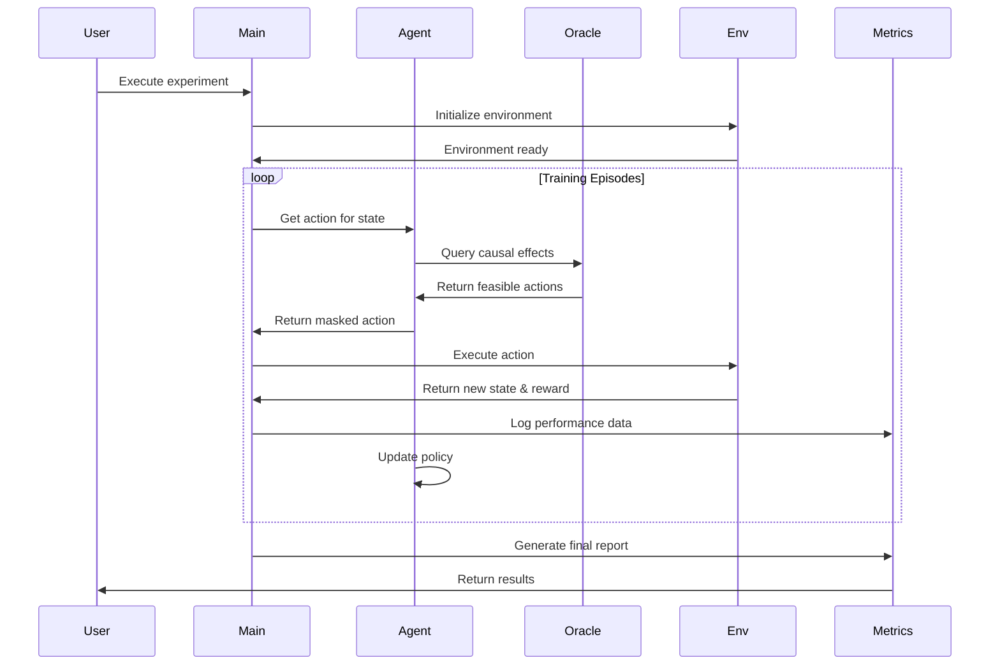

# 🔧 Healthcare CRL Framework - Technical Documentation

[](https://www.python.org/downloads/)
[](https://github.com)
[](https://github.com)

> **Comprehensive technical documentation for the Healthcare Supply Chain Causal-Reinforcement Learning Framework**

---

## 📋 Table of Contents

- [Architecture Overview](#-architecture-overview)
- [Core Components](#-core-components)
- [API Reference](#-api-reference)
- [Configuration Guide](#-configuration-guide)
- [Installation & Setup](#-installation--setup)
- [Development Guidelines](#-development-guidelines)
- [Algorithm Details](#-algorithm-details)
- [Performance Tuning](#-performance-tuning)
- [Troubleshooting](#-troubleshooting)
- [Testing Framework](#-testing-framework)

---

## 🏗️ Architecture Overview

### **System Architecture Layers**

```
┌─────────────────────────────────────────────────────────────┐
│                    Application Layer                         │
│  ┌─────────────┐  ┌─────────────┐  ┌─────────────────────┐  │
│  │ Dashboard   │  │ CLI Tool    │  │ API Endpoints       │  │
│  │ Interface   │  │ Interface   │  │ (REST/GraphQL)      │  │
│  └─────────────┘  └─────────────┘  └─────────────────────┘  │
└─────────────────────────────────────────────────────────────┘
┌─────────────────────────────────────────────────────────────┐
│                    Business Logic Layer                      │
│  ┌─────────────┐  ┌─────────────┐  ┌─────────────────────┐  │
│  │ Experiment  │  │ Evaluation  │  │ Model Management    │  │
│  │ Controller  │  │ Engine      │  │ & Persistence       │  │
│  └─────────────┘  └─────────────┘  └─────────────────────┘  │
└─────────────────────────────────────────────────────────────┘
┌─────────────────────────────────────────────────────────────┐
│                     AI/ML Core Layer                         │
│  ┌─────────────┐  ┌─────────────┐  ┌─────────────────────┐  │
│  │ CRL Agent   │  │ Causal      │  │ Baseline Agents     │  │
│  │ (DQN+Causal)│  │ Oracle      │  │ (Det/RL/Heuristic)  │  │
│  └─────────────┘  └─────────────┘  └─────────────────────┘  │
└─────────────────────────────────────────────────────────────┘
┌─────────────────────────────────────────────────────────────┐
│                    Environment Layer                         │
│  ┌─────────────┐  ┌─────────────┐  ┌─────────────────────┐  │
│  │ Healthcare  │  │ Disruption  │  │ Market Dynamics     │  │
│  │ Entities    │  │ Simulator   │  │ & Economics         │  │
│  └─────────────┘  └─────────────┘  └─────────────────────┘  │
└─────────────────────────────────────────────────────────────┘
┌─────────────────────────────────────────────────────────────┐
│                      Data Layer                              │
│  ┌─────────────┐  ┌─────────────┐  ┌─────────────────────┐  │
│  │ Synthetic   │  │ Historical  │  │ Real-time Metrics   │  │
│  │ Data Gen    │  │ Data Store  │  │ & Telemetry         │  │
│  └─────────────┘  └─────────────┘  └─────────────────────┘  │
└─────────────────────────────────────────────────────────────┘
```

### **Component Interaction Flow**



---

## 🧩 Core Components

### **1. CRL Agent (`crl_agent.py`)**

#### **Class Structure:**
```python
class CRLAgent:
    def __init__(self, state_size, action_size, causal_oracle, config):
        self.q_network = self._build_dqn()
        self.target_network = self._build_dqn()
        self.causal_oracle = causal_oracle
        self.causal_lambda = config.get('causal_lambda', 0.5)
        self.use_action_masking = config.get('use_action_masking', True)
```

#### **Key Methods:**

| Method | Purpose | Parameters | Returns |
|--------|---------|------------|---------|
| `act(state, available_actions)` | Select action using ε-greedy + causal masking | `state`: Current environment state<br>`available_actions`: Valid actions | `int`: Selected action index |
| `remember(state, action, reward, next_state, done)` | Store experience in replay buffer | Experience tuple | `None` |
| `replay(batch_size)` | Train network on batch from memory | `batch_size`: Training batch size | `float`: Loss value |
| `_causal_action_masking(state, q_values)` | Apply causal constraints to action selection | `state`: Current state<br>`q_values`: Raw Q-values | `np.array`: Masked Q-values |
| `_compute_causal_reward(state, action, reward)` | Enhance reward with causal knowledge | Standard RL tuple | `float`: Enhanced reward |

#### **Causal Action Masking Algorithm:**
```python
def _causal_action_masking(self, state, q_values):
    """Apply causal constraints to action selection"""
    
    # Get feasible actions from causal oracle
    feasible_actions = self.causal_oracle.get_feasible_actions(state)
    
    # Create mask (feasible=1, infeasible=0)
    mask = np.zeros(len(q_values))
    mask[feasible_actions] = 1
    
    # Apply masking: set infeasible actions to very negative values
    masked_q_values = np.where(mask, q_values, -np.inf)
    
    return masked_q_values
```

### **2. Causal Oracle (`causal_graph.py`)**

#### **Bayesian Network Structure:**
```python
class CausalOracle:
    def __init__(self, config):
        self.graph = self._build_causal_graph()
        self.inference_engine = BayesianInference(self.graph)
        
    def _build_causal_graph(self):
        """Construct domain-specific causal relationships"""
        nodes = [
            'supplier_reliability', 'inventory_level', 'demand_forecast',
            'disruption_severity', 'lead_time', 'service_level',
            'cost_per_unit', 'patient_satisfaction', 'staff_workload'
        ]
        
        edges = [
            ('supplier_reliability', 'lead_time'),
            ('supplier_reliability', 'cost_per_unit'),
            ('inventory_level', 'service_level'),
            ('disruption_severity', 'supplier_reliability'),
            ('lead_time', 'service_level'),
            ('service_level', 'patient_satisfaction'),
            # ... additional 35+ relationships
        ]
```

#### **Causal Inference Methods:**

| Method | Algorithm | Use Case | Computational Complexity |
|--------|-----------|----------|-------------------------|
| `predict_effect(intervention, outcome)` | Do-calculus | Predict intervention outcomes | O(n²) where n = nodes |
| `get_feasible_actions(state)` | Constraint propagation | Action masking | O(k) where k = actions |
| `explain_recommendation(state, action)` | Counterfactual reasoning | Explainable AI | O(n³) |
| `update_beliefs(evidence)` | Bayesian updating | Online learning | O(n²) |

### **3. Environment (`data_pipeline.py`)**

#### **Healthcare Supply Chain Simulation:**

```python
class HealthcareSupplyChainEnv:
    def __init__(self, config):
        self.hospitals = self._generate_hospitals(config.num_hospitals)
        self.suppliers = self._generate_suppliers(config.num_suppliers)
        self.distributors = self._generate_distributors(config.num_distributors)
        self.disruption_engine = DisruptionEngine(config.disruption_types)
        
    def step(self, action):
        """Execute one environment step"""
        # 1. Apply action to environment
        self._apply_action(action)
        
        # 2. Update world state (supply flows, inventory, etc.)
        self._update_world_state()
        
        # 3. Check for disruptions
        disruptions = self.disruption_engine.check_disruptions()
        self._apply_disruptions(disruptions)
        
        # 4. Calculate reward
        reward = self._calculate_reward()
        
        # 5. Check episode termination
        done = self._check_episode_done()
        
        return self.get_state(), reward, done, {}
```

#### **Action Space Definition:**

| Action ID | Action Type | Parameters | Impact Scope | Cost Factor |
|-----------|-------------|------------|--------------|-------------|
| 0 | Switch Primary Supplier | `supplier_id`, `product_category` | Hospital-specific | Medium |
| 1 | Increase Safety Stock | `percentage_increase`, `product_type` | Inventory system | High |
| 2 | Emergency Procurement | `quantity`, `urgency_level` | Immediate supply | Very High |
| 3 | Reroute Shipments | `origin`, `destination`, `route` | Logistics network | Low |
| 4 | Reallocate Resources | `source_facility`, `target_facility` | Multi-facility | Medium |
| 5 | Activate Backup Supplier | `backup_supplier_id`, `activation_speed` | Supply network | Medium |

### **4. Baseline Agents (`baselines.py`)**

#### **Agent Comparison Matrix:**

| Agent Type | Decision Algorithm | Learning Capability | Causal Knowledge | Computational Cost |
|------------|-------------------|-------------------|------------------|-------------------|
| **CRL Agent** | Deep Q-Network + Causal Masking | ✅ Continuous | ✅ Full integration | High |
| **Deterministic** | Rule-based heuristics | ❌ Static | ❌ None | Very Low |
| **Pure RL** | Standard DQN | ✅ Continuous | ❌ None | Medium |
| **Causal Heuristic** | Causal rules only | ❌ Static | ✅ Rule-based | Low |

---

## 🔌 API Reference

### **Main Framework Interface**

#### **Command Line Interface:**
```bash
# Training mode
python main.py --mode train --config config/custom.yaml --episodes 1000

# Evaluation mode  
python main.py --mode evaluate --agents all --episodes 500 --output results/

# Dashboard mode
python main.py --mode dashboard --port 8080 --host localhost

# Health check
python main.py --health-check --verbose
```

#### **Python API:**
```python
from src.framework import HealthcareCRLFramework

# Initialize framework
framework = HealthcareCRLFramework('config/default_config.yaml')

# Train CRL agent
results = framework.train_agent(
    agent_type='crl',
    episodes=1000,
    save_path='models/crl_agent.pkl'
)

# Evaluate all agents
comparison = framework.evaluate_agents(
    episodes=500,
    agents=['crl', 'deterministic', 'pure_rl', 'causal_heuristic'],
    metrics=['resilience_score', 'recovery_time', 'cost_efficiency']
)

# Generate report
framework.generate_report(
    results=comparison,
    format='pdf',
    output_path='reports/evaluation_report.pdf'
)
```

### **REST API Endpoints**

| Endpoint | Method | Purpose | Request Body | Response |
|----------|--------|---------|--------------|----------|
| `/api/v1/train` | POST | Start training | `{"agent": "crl", "episodes": 1000}` | `{"job_id": "uuid", "status": "started"}` |
| `/api/v1/evaluate` | POST | Run evaluation | `{"agents": ["crl", "baseline"], "episodes": 500}` | `{"results": {...}}` |
| `/api/v1/predict` | POST | Get action prediction | `{"state": [...], "agent_id": "crl"}` | `{"action": 2, "confidence": 0.87}` |
| `/api/v1/metrics` | GET | Get performance metrics | - | `{"metrics": {...}}` |
| `/api/v1/models` | GET | List available models | - | `{"models": [...]}` |

---

## ⚙️ Configuration Guide

### **Configuration File Structure (`default_config.yaml`)**

```yaml
# Environment Configuration
environment:
  num_hospitals: 5000
  num_suppliers: 500
  num_distributors: 200
  episode_length: 100
  disruption_types:
    - pandemic
    - natural_disaster
    - cyber_attack
    - supply_shortage
  disruption_probability: 0.15
  geographic_scope: "US"
  
# Agent Configuration
agents:
  crl_agent:
    learning_rate: 0.001
    epsilon_start: 1.0
    epsilon_end: 0.01
    epsilon_decay: 0.995
    batch_size: 32
    memory_size: 10000
    target_update_frequency: 100
    causal_lambda: 0.5
    use_action_masking: true
    reward_shaping_factor: 0.3
    
  baseline_agents:
    deterministic:
      rule_update_frequency: 50
      safety_stock_multiplier: 2.0
    pure_rl:
      learning_rate: 0.001
      exploration_strategy: "epsilon_greedy"
    causal_heuristic:
      intervention_threshold: 0.7
      causal_confidence_min: 0.8

# Evaluation Configuration
evaluation:
  metrics:
    - recovery_time
    - service_level
    - cost_efficiency
    - adaptability_score
    - disruption_resilience
  statistical_tests:
    - t_test
    - mann_whitney_u
    - effect_size_cohen_d
  confidence_level: 0.95
  
# Logging Configuration
logging:
  level: INFO
  file_path: logs/framework.log
  include_timestamp: true
  log_agent_decisions: true
  log_causal_reasoning: true

# Performance Configuration
performance:
  parallel_episodes: 4
  gpu_acceleration: true
  memory_optimization: true
  checkpoint_frequency: 100
```

### **Configuration Parameters Reference**

#### **Environment Parameters:**

| Parameter | Type | Default | Description | Valid Range |
|-----------|------|---------|-------------|-------------|
| `num_hospitals` | int | 5000 | Number of hospitals in simulation | 100-10000 |
| `episode_length` | int | 100 | Steps per training episode | 50-500 |
| `disruption_probability` | float | 0.15 | Probability of disruption per step | 0.0-1.0 |
| `disruption_severity` | str | "medium" | Default disruption intensity | low/medium/high |

#### **Agent Parameters:**

| Parameter | Type | Default | Description | Impact |
|-----------|------|---------|-------------|---------|
| `learning_rate` | float | 0.001 | Neural network learning rate | Convergence speed |
| `causal_lambda` | float | 0.5 | Weight of causal vs RL components | Algorithm balance |
| `use_action_masking` | bool | true | Enable causal action constraints | Performance quality |
| `reward_shaping_factor` | float | 0.3 | Causal reward enhancement weight | Learning efficiency |

---

## 🚀 Installation & Setup

### **System Requirements**

| Component | Minimum | Recommended | 
|-----------|---------|-------------|
| **OS** | Windows 10, macOS 10.15, Ubuntu 18.04 | Windows 11, macOS 12+, Ubuntu 20.04+ |
| **Python** | 3.8 | 3.9+ |
| **RAM** | 8 GB | 16 GB+ |
| **Storage** | 5 GB | 20 GB+ |
| **GPU** | Optional | NVIDIA RTX 3060+ or equivalent |

### **Dependency Installation**

#### **Core Dependencies:**
```bash
# Core ML libraries
numpy>=1.21.0
pandas>=1.3.0
scikit-learn>=1.0.0
tensorflow>=2.8.0
torch>=1.10.0

# Causal inference
pgmpy>=0.1.18
causalnex>=0.11.0
networkx>=2.6.0

# Visualization
matplotlib>=3.5.0
seaborn>=0.11.0
plotly>=5.0.0

# Web framework (for dashboard)
flask>=2.0.0
dash>=2.0.0

# Utilities
pyyaml>=6.0
tqdm>=4.62.0
colorama>=0.4.4
```

#### **Installation Steps:**

1. **Clone Repository:**
```bash
git clone <repository-url>
cd healthcare-crl-framework
```

2. **Create Virtual Environment:**
```bash
python -m venv healthcare_crl_env
source healthcare_crl_env/bin/activate  # Linux/Mac
# healthcare_crl_env\Scripts\activate  # Windows
```

3. **Install Framework:**
```bash
python setup.py install
```

4. **Verify Installation:**
```bash
python setup.py --health-check
```

### **Docker Deployment**

#### **Dockerfile:**
```dockerfile
FROM python:3.9-slim

WORKDIR /app
COPY requirements.txt .
RUN pip install -r requirements.txt

COPY . .
RUN python setup.py install

EXPOSE 8080
CMD ["python", "main.py", "--mode", "dashboard", "--host", "0.0.0.0"]
```

#### **Docker Compose:**
```yaml
version: '3.8'
services:
  healthcare-crl:
    build: .
    ports:
      - "8080:8080"
    volumes:
      - ./data:/app/data
      - ./results:/app/results
    environment:
      - PYTHONUNBUFFERED=1
```

---

## 💻 Development Guidelines

### **Code Structure Standards**

#### **Directory Organization:**
```
src/
├── agents/                 # AI agent implementations
│   ├── base_agent.py      # Abstract agent interface
│   ├── crl_agent.py       # CRL agent implementation
│   └── baseline_agents.py # Comparison agents
├── environment/           # Simulation environment
│   ├── healthcare_env.py  # Main environment class
│   ├── entities.py        # Hospital, supplier, distributor classes
│   └── disruptions.py     # Disruption modeling
├── causal/                # Causal inference components
│   ├── causal_graph.py    # Bayesian network construction
│   ├── oracle.py          # Causal reasoning engine
│   └── inference.py       # Causal inference algorithms
├── evaluation/            # Performance assessment
│   ├── metrics.py         # Resilience metrics calculation
│   ├── statistical.py     # Statistical analysis tools
│   └── visualization.py   # Result plotting and dashboards
└── utils/                 # Utility functions
    ├── config.py          # Configuration management
    ├── logging.py         # Logging utilities
    └── data_utils.py      # Data processing helpers
```

#### **Coding Standards:**

```python
# Type hints are mandatory
def train_agent(self, episodes: int, save_path: Optional[str] = None) -> Dict[str, Any]:
    """Train the CRL agent for specified episodes.
    
    Args:
        episodes: Number of training episodes
        save_path: Optional path to save trained model
        
    Returns:
        Dictionary containing training metrics and final performance
        
    Raises:
        ValueError: If episodes <= 0
        IOError: If save_path is invalid
    """

# Comprehensive docstrings required
# Error handling with specific exceptions
# Logging at appropriate levels
# Unit tests for all public methods
```

### **Testing Framework**

#### **Test Structure:**
```
tests/
├── unit/                  # Unit tests for individual components
│   ├── test_crl_agent.py
│   ├── test_causal_oracle.py
│   └── test_environment.py
├── integration/           # Integration tests for component interaction
│   ├── test_agent_oracle_integration.py
│   └── test_full_pipeline.py
├── performance/           # Performance and benchmark tests
│   ├── test_scalability.py
│   └── test_memory_usage.py
└── fixtures/              # Test data and mock objects
    ├── sample_configs.py
    └── mock_environments.py
```

#### **Testing Commands:**
```bash
# Run all tests
pytest tests/ -v

# Run with coverage
pytest tests/ --cov=src --cov-report=html

# Run specific test category
pytest tests/unit/ -v
pytest tests/integration/ -v

# Performance benchmarking
pytest tests/performance/ --benchmark-only
```

### **Contributing Workflow**

1. **Feature Branch Creation:**
```bash
git checkout -b feature/new-causal-algorithm
```

2. **Development Process:**
- Write failing tests first (TDD approach)
- Implement feature with proper documentation
- Ensure all tests pass
- Update configuration examples if needed

3. **Code Review Checklist:**
- [ ] All tests pass
- [ ] Code coverage > 90%
- [ ] Documentation updated
- [ ] Type hints present
- [ ] Performance impact assessed
- [ ] Backward compatibility maintained

4. **Pull Request Process:**
```bash
git push origin feature/new-causal-algorithm
# Create PR through GitHub/GitLab interface
# Address review feedback
# Merge after approval
```

---

## 🧮 Algorithm Details

### **CRL Algorithm Pseudocode**

```python
def crl_training_algorithm():
    """Causal-Reinforcement Learning Training Algorithm"""
    
    # Initialize components
    agent = CRLAgent(state_size, action_size, causal_oracle)
    environment = HealthcareSupplyChainEnv()
    replay_buffer = ReplayBuffer(capacity=10000)
    
    for episode in range(num_episodes):
        state = environment.reset()
        total_reward = 0
        
        for step in range(episode_length):
            # 1. Causal Action Masking
            available_actions = environment.get_available_actions(state)
            feasible_actions = causal_oracle.get_feasible_actions(state)
            masked_actions = intersect(available_actions, feasible_actions)
            
            # 2. Action Selection (ε-greedy with causal constraints)
            if random() < epsilon:
                action = random_choice(masked_actions)
            else:
                q_values = agent.get_q_values(state)
                masked_q_values = apply_causal_mask(q_values, masked_actions)
                action = argmax(masked_q_values)
            
            # 3. Environment Interaction
            next_state, reward, done = environment.step(action)
            
            # 4. Causal Reward Shaping
            causal_reward = causal_oracle.compute_causal_reward(
                state, action, reward, next_state
            )
            enhanced_reward = (1 - causal_lambda) * reward + causal_lambda * causal_reward
            
            # 5. Experience Storage
            replay_buffer.add(state, action, enhanced_reward, next_state, done)
            
            # 6. Agent Learning
            if len(replay_buffer) > batch_size:
                batch = replay_buffer.sample(batch_size)
                loss = agent.train_on_batch(batch)
            
            state = next_state
            total_reward += enhanced_reward
            
            if done:
                break
        
        # 7. Causal Graph Updates (optional)
        if episode % causal_update_frequency == 0:
            causal_oracle.update_graph_from_experience(replay_buffer)
        
        # 8. Logging and Metrics
        log_episode_metrics(episode, total_reward, loss)
```

### **Causal Inference Algorithms**

#### **1. Do-Calculus for Effect Prediction:**
```python
def predict_causal_effect(intervention_node, outcome_node, evidence=None):
    """
    Predict causal effect using Pearl's do-calculus
    
    P(Y|do(X)) = Σ_z P(Y|X,Z,Pa(Y)) * P(Z|Pa(Z))
    where Pa(·) denotes parents in the causal graph
    """
    
    # Step 1: Identify confounders
    confounders = identify_confounders(intervention_node, outcome_node)
    
    # Step 2: Apply backdoor adjustment
    if confounders:
        effect = 0
        for confounder_values in enumerate_values(confounders):
            conditional_prob = compute_conditional_probability(
                outcome_node, 
                given={intervention_node: intervention_value, **confounder_values}
            )
            confounder_prob = compute_probability(confounder_values)
            effect += conditional_prob * confounder_prob
    else:
        # Direct causal effect (no confounders)
        effect = compute_conditional_probability(
            outcome_node, 
            given={intervention_node: intervention_value}
        )
    
    return effect
```

#### **2. Constraint-Based Causal Discovery:**
```python
def learn_causal_structure_pc_algorithm(data, significance_level=0.05):
    """
    PC Algorithm for causal structure learning
    """
    
    # Step 1: Start with complete undirected graph
    graph = complete_graph(variables)
    
    # Step 2: Remove edges based on conditional independence
    for order in range(len(variables)):
        for (X, Y) in graph.edges():
            # Find conditioning sets of size 'order'
            neighbors_X = graph.neighbors(X) - {Y}
            for conditioning_set in combinations(neighbors_X, order):
                # Test conditional independence X ⊥ Y | Z
                p_value = conditional_independence_test(X, Y, conditioning_set, data)
                if p_value > significance_level:
                    graph.remove_edge(X, Y)
                    break
    
    # Step 3: Orient edges using orientation rules
    oriented_graph = orient_edges_v_structures(graph, data)
    oriented_graph = apply_orientation_rules(oriented_graph)
    
    return oriented_graph
```

### **Performance Metrics Algorithms**

#### **Resilience Score Calculation:**
```python
def calculate_resilience_score(episode_data):
    """
    Composite resilience score combining multiple factors
    
    Resilience = w1*Recovery_Speed + w2*Service_Continuity + 
                 w3*Cost_Efficiency + w4*Adaptability
    """
    
    # 1. Recovery Speed (0-1, higher is better)
    recovery_time = calculate_recovery_time(episode_data)
    max_recovery_time = 30  # days
    recovery_speed = max(0, 1 - recovery_time / max_recovery_time)
    
    # 2. Service Continuity (0-1, higher is better)
    service_levels = episode_data['service_levels']
    service_continuity = np.mean(service_levels)
    
    # 3. Cost Efficiency (0-1, higher is better)
    actual_costs = episode_data['total_costs']
    baseline_costs = episode_data['baseline_costs']
    cost_efficiency = max(0, 1 - actual_costs / baseline_costs)
    
    # 4. Adaptability (0-1, higher is better)
    adaptability = calculate_adaptability_score(episode_data)
    
    # Weighted combination
    weights = [0.25, 0.30, 0.25, 0.20]  # Sum = 1.0
    resilience_score = (
        weights[0] * recovery_speed +
        weights[1] * service_continuity +
        weights[2] * cost_efficiency +
        weights[3] * adaptability
    )
    
    return resilience_score
```

---

## 🎛️ Performance Tuning

### **Optimization Guidelines**

#### **1. Memory Optimization:**
```python
# Use memory-efficient data structures
from collections import deque
import numpy as np

class OptimizedReplayBuffer:
    def __init__(self, capacity):
        self.capacity = capacity
        self.buffer = deque(maxlen=capacity)  # Automatic size management
        self.priorities = deque(maxlen=capacity)  # For prioritized experience replay
        
    def add(self, experience, priority=1.0):
        self.buffer.append(experience)
        self.priorities.append(priority)
        
    def sample(self, batch_size):
        # Prioritized sampling for better learning efficiency
        probabilities = np.array(self.priorities) / sum(self.priorities)
        indices = np.random.choice(len(self.buffer), batch_size, p=probabilities)
        return [self.buffer[i] for i in indices]
```

#### **2. Computational Optimization:**
```python
# Vectorized operations for batch processing
def batch_causal_inference(states, actions, causal_oracle):
    """Process multiple states simultaneously"""
    
    # Convert to numpy arrays for vectorized operations
    states_array = np.array(states)
    actions_array = np.array(actions)
    
    # Batch causal effect computation
    effects = causal_oracle.batch_predict_effects(states_array, actions_array)
    
    # Vectorized feasibility checking
    feasibility_mask = causal_oracle.batch_check_feasibility(states_array, actions_array)
    
    return effects, feasibility_mask

# GPU acceleration for neural networks
import tensorflow as tf

# Enable GPU memory growth
gpus = tf.config.experimental.list_physical_devices('GPU')
if gpus:
    for gpu in gpus:
        tf.config.experimental.set_memory_growth(gpu, True)

# Use mixed precision training
policy = tf.keras.mixed_precision.Policy('mixed_float16')
tf.keras.mixed_precision.set_global_policy(policy)
```

#### **3. Hyperparameter Tuning:**

| Parameter | Search Range | Tuning Method | Expected Impact |
|-----------|--------------|---------------|-----------------|
| `learning_rate` | [1e-5, 1e-2] | Grid search | Convergence speed |
| `causal_lambda` | [0.0, 1.0] | Bayesian optimization | Algorithm balance |
| `epsilon_decay` | [0.99, 0.999] | Random search | Exploration-exploitation |
| `batch_size` | [16, 128] | Powers of 2 | Training stability |

#### **Automated Hyperparameter Optimization:**
```python
import optuna

def objective(trial):
    # Suggest hyperparameters
    learning_rate = trial.suggest_float('learning_rate', 1e-5, 1e-2, log=True)
    causal_lambda = trial.suggest_float('causal_lambda', 0.0, 1.0)
    batch_size = trial.suggest_categorical('batch_size', [16, 32, 64, 128])
    
    # Train agent with suggested parameters
    config = create_config(learning_rate, causal_lambda, batch_size)
    performance = train_and_evaluate_agent(config)
    
    return performance['resilience_score']

# Run optimization
study = optuna.create_study(direction='maximize')
study.optimize(objective, n_trials=100)
```

---

## 🔧 Troubleshooting

### **Common Issues and Solutions**

#### **1. Training Convergence Issues**

| Problem | Symptoms | Solution | Prevention |
|---------|----------|----------|------------|
| **Slow Convergence** | Loss plateaus early | Increase learning rate, adjust reward shaping | Monitor learning curves, early stopping |
| **Unstable Training** | High variance in rewards | Reduce learning rate, increase batch size | Gradient clipping, target network updates |
| **Poor Exploration** | Agent stuck in local optima | Increase epsilon decay period | Curiosity-driven exploration |

#### **2. Memory and Performance Issues**

```python
# Memory leak detection
import psutil
import gc

def monitor_memory_usage():
    """Monitor memory usage during training"""
    process = psutil.Process()
    memory_info = process.memory_info()
    print(f"Memory usage: {memory_info.rss / 1024 / 1024:.2f} MB")
    
    # Force garbage collection
    gc.collect()

# Profiling code performance
import cProfile
import pstats

def profile_training():
    """Profile training performance"""
    profiler = cProfile.Profile()
    profiler.enable()
    
    # Run training code
    train_agent()
    
    profiler.disable()
    stats = pstats.Stats(profiler)
    stats.sort_stats('cumulative').print_stats(10)
```

#### **3. Configuration Errors**

```python
# Configuration validation
def validate_config(config):
    """Validate configuration parameters"""
    
    errors = []
    
    # Check required parameters
    required_params = ['environment.num_hospitals', 'agents.crl_agent.learning_rate']
    for param in required_params:
        if not config.get(param.split('.')[0], {}).get(param.split('.')[1]):
            errors.append(f"Missing required parameter: {param}")
    
    # Check parameter ranges
    if config.get('agents', {}).get('crl_agent', {}).get('learning_rate', 0) <= 0:
        errors.append("Learning rate must be positive")
    
    # Check data consistency
    if config.get('environment', {}).get('episode_length', 0) <= 0:
        errors.append("Episode length must be positive")
    
    if errors:
        raise ValueError(f"Configuration errors: {'; '.join(errors)}")
```

### **Debug Mode and Logging**

#### **Enable Detailed Logging:**
```python
import logging

# Configure detailed logging
logging.basicConfig(
    level=logging.DEBUG,
    format='%(asctime)s - %(name)s - %(levelname)s - %(message)s',
    handlers=[
        logging.FileHandler('debug.log'),
        logging.StreamHandler()
    ]
)

# Agent-specific logging
logger = logging.getLogger('CRLAgent')
logger.debug(f"Action selected: {action}, Q-values: {q_values}")
logger.debug(f"Causal mask applied: {causal_mask}")
```

#### **Visualization for Debugging:**
```python
import matplotlib.pyplot as plt

def plot_training_diagnostics(training_history):
    """Plot training diagnostics"""
    
    fig, axes = plt.subplots(2, 2, figsize=(12, 8))
    
    # Loss curve
    axes[0, 0].plot(training_history['losses'])
    axes[0, 0].set_title('Training Loss')
    axes[0, 0].set_xlabel('Episode')
    axes[0, 0].set_ylabel('Loss')
    
    # Reward curve
    axes[0, 1].plot(training_history['rewards'])
    axes[0, 1].set_title('Episode Rewards')
    axes[0, 1].set_xlabel('Episode')
    axes[0, 1].set_ylabel('Total Reward')
    
    # Epsilon decay
    axes[1, 0].plot(training_history['epsilon_values'])
    axes[1, 0].set_title('Exploration Rate (Epsilon)')
    axes[1, 0].set_xlabel('Episode')
    axes[1, 0].set_ylabel('Epsilon')
    
    # Q-value distribution
    axes[1, 1].hist(training_history['q_values'][-1000:], bins=50)
    axes[1, 1].set_title('Q-value Distribution (Last 1000 steps)')
    axes[1, 1].set_xlabel('Q-value')
    axes[1, 1].set_ylabel('Frequency')
    
    plt.tight_layout()
    plt.savefig('training_diagnostics.png')
    plt.show()
```

---

## 🧪 Testing Framework

### **Test Categories**

#### **1. Unit Tests**
```python
import unittest
import numpy as np
from src.agents.crl_agent import CRLAgent
from src.causal.causal_oracle import CausalOracle

class TestCRLAgent(unittest.TestCase):
    
    def setUp(self):
        """Set up test fixtures"""
        self.state_size = 10
        self.action_size = 5
        self.oracle = CausalOracle()
        self.agent = CRLAgent(self.state_size, self.action_size, self.oracle)
    
    def test_action_selection(self):
        """Test action selection mechanism"""
        state = np.random.rand(self.state_size)
        available_actions = [0, 1, 2]
        
        action = self.agent.act(state, available_actions)
        
        self.assertIn(action, available_actions)
        self.assertIsInstance(action, int)
    
    def test_causal_masking(self):
        """Test causal action masking"""
        state = np.random.rand(self.state_size)
        q_values = np.random.rand(self.action_size)
        
        masked_values = self.agent._causal_action_masking(state, q_values)
        
        # Check that infeasible actions have -inf values
        feasible_actions = self.oracle.get_feasible_actions(state)
        for i in range(self.action_size):
            if i not in feasible_actions:
                self.assertEqual(masked_values[i], -np.inf)
    
    def test_experience_replay(self):
        """Test experience replay mechanism"""
        # Add some experiences
        for _ in range(100):
            state = np.random.rand(self.state_size)
            action = np.random.randint(0, self.action_size)
            reward = np.random.rand()
            next_state = np.random.rand(self.state_size)
            done = np.random.choice([True, False])
            
            self.agent.remember(state, action, reward, next_state, done)
        
        # Test replay
        initial_loss = self.agent.replay(batch_size=32)
        self.assertIsInstance(initial_loss, float)
        self.assertGreaterEqual(initial_loss, 0)

if __name__ == '__main__':
    unittest.main()
```

#### **2. Integration Tests**
```python
class TestFrameworkIntegration(unittest.TestCase):
    
    def test_end_to_end_training(self):
        """Test complete training pipeline"""
        config = load_test_config()
        framework = HealthcareCRLFramework(config)
        
        # Run short training
        results = framework.train_agent(
            agent_type='crl',
            episodes=10,
            verbose=False
        )
        
        # Verify results structure
        self.assertIn('final_reward', results)
        self.assertIn('training_loss', results)
        self.assertIn('convergence_episode', results)
        
        # Verify performance bounds
        self.assertGreater(results['final_reward'], -1000)  # Reasonable reward
        self.assertLess(results['training_loss'], 100)      # Reasonable loss
    
    def test_multi_agent_evaluation(self):
        """Test comparative agent evaluation"""
        config = load_test_config()
        framework = HealthcareCRLFramework(config)
        
        results = framework.evaluate_agents(
            episodes=5,
            agents=['crl', 'deterministic'],
            verbose=False
        )
        
        # Verify results for each agent
        for agent_name in ['crl', 'deterministic']:
            self.assertIn(agent_name, results)
            self.assertIn('mean_reward', results[agent_name])
            self.assertIn('std_reward', results[agent_name])
```

#### **3. Performance Tests**
```python
import time
import pytest

class TestPerformance:
    
    @pytest.mark.benchmark
    def test_training_speed_benchmark(self, benchmark):
        """Benchmark training speed"""
        
        def train_single_episode():
            agent = create_test_agent()
            env = create_test_environment()
            return run_single_episode(agent, env)
        
        result = benchmark(train_single_episode)
        
        # Assert reasonable performance (< 1 second per episode)
        assert result < 1.0
    
    @pytest.mark.benchmark
    def test_causal_inference_speed(self, benchmark):
        """Benchmark causal inference performance"""
        
        oracle = CausalOracle()
        test_states = generate_test_states(100)
        
        def batch_inference():
            return oracle.batch_predict_effects(test_states)
        
        result = benchmark(batch_inference)
        
        # Assert batch processing efficiency
        assert result < 0.1  # Should process 100 states in < 0.1 seconds
    
    def test_memory_usage_limits(self):
        """Test memory usage stays within bounds"""
        initial_memory = get_memory_usage()
        
        # Run memory-intensive operations
        agent = CRLAgent(1000, 100, CausalOracle())
        for _ in range(1000):
            agent.remember(*generate_random_experience())
        
        final_memory = get_memory_usage()
        memory_increase = final_memory - initial_memory
        
        # Assert memory usage is reasonable (< 500 MB increase)
        assert memory_increase < 500 * 1024 * 1024
```

### **Continuous Integration Setup**

#### **GitHub Actions Workflow (`.github/workflows/ci.yml`):**
```yaml
name: Continuous Integration

on: [push, pull_request]

jobs:
  test:
    runs-on: ubuntu-latest
    strategy:
      matrix:
        python-version: [3.8, 3.9, 3.10]
    
    steps:
    - uses: actions/checkout@v2
    
    - name: Set up Python ${{ matrix.python-version }}
      uses: actions/setup-python@v2
      with:
        python-version: ${{ matrix.python-version }}
    
    - name: Install dependencies
      run: |
        python -m pip install --upgrade pip
        pip install -r requirements.txt
        pip install -r requirements-dev.txt
    
    - name: Run linting
      run: |
        flake8 src/ tests/
        black --check src/ tests/
        mypy src/
    
    - name: Run unit tests
      run: |
        pytest tests/unit/ -v --cov=src --cov-report=xml
    
    - name: Run integration tests
      run: |
        pytest tests/integration/ -v
    
    - name: Run performance tests
      run: |
        pytest tests/performance/ --benchmark-only
    
    - name: Upload coverage reports
      uses: codecov/codecov-action@v1
      with:
        file: ./coverage.xml
```

---

## 📚 Additional Resources

### **Research Papers and References**

1. **Causal Inference:**
   - Pearl, J. (2009). "Causality: Models, Reasoning and Inference"
   - Spirtes, P., Glymour, C., & Scheines, R. (2000). "Causation, Prediction, and Search"

2. **Reinforcement Learning:**
   - Sutton, R. S., & Barto, A. G. (2018). "Reinforcement Learning: An Introduction"
   - Mnih, V., et al. (2015). "Human-level control through deep reinforcement learning"

3. **Supply Chain Management:**
   - Christopher, M. (2016). "Logistics & Supply Chain Management"
   - Chopra, S., & Meindl, P. (2015). "Supply Chain Management: Strategy, Planning, and Operation"

### **External Libraries and Tools**

| Library | Version | Purpose | Documentation |
|---------|---------|---------|---------------|
| **pgmpy** | 0.1.18+ | Probabilistic graphical models | [pgmpy.org](https://pgmpy.org/) |
| **CausalNex** | 0.11.0+ | Causal inference toolkit | [causalnex.readthedocs.io](https://causalnex.readthedocs.io/) |
| **NetworkX** | 2.6+ | Graph analysis | [networkx.org](https://networkx.org/) |
| **TensorFlow** | 2.8+ | Deep learning | [tensorflow.org](https://tensorflow.org/) |
| **PyTorch** | 1.10+ | Deep learning (alternative) | [pytorch.org](https://pytorch.org/) |

### **Community and Support**

- **GitHub Issues**: Report bugs and feature requests
- **Discussion Forum**: Community discussions and Q&A
- **Documentation**: Comprehensive guides and API reference
- **Tutorials**: Step-by-step implementation examples
- **Slack Channel**: Real-time community support

---

## 📄 License and Citation

This framework is released under the MIT License. See `LICENSE.md` for details.

### **Citation:**
```bibtex
@software{healthcare_crl_framework_2025,
  title={Healthcare Supply Chain Causal-Reinforcement Learning Framework},
  author={Healthcare AI Research Team},
  year={2025},
  version={1.0.0},
  url={https://github.com/healthcare-ai/crl-framework}
}
```

---

*Last updated: October 24, 2025 | Version 1.0.0*